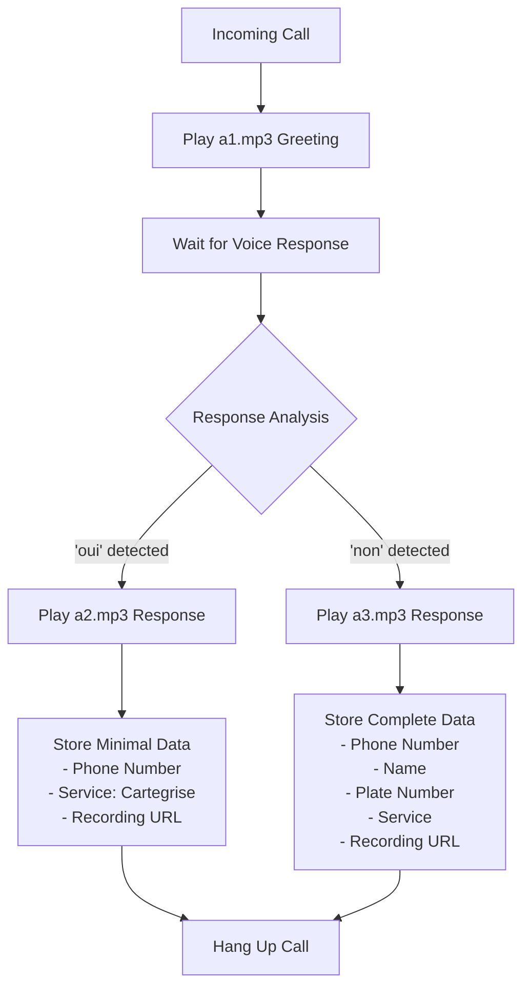

# Client Voice System Summary

## System Overview

This document summarizes the implementation of your client voice-based call system that will:

1. Play your client's recorded greeting (a1.mp3)
2. Listen for a response of either "oui" or "non"
3. Based on the response:
   - If "oui": Play a2.mp3 and store only phone number with service="Cartegrise"
   - If "non": Play a3.mp3 and store complete information (phone, name, plate, service)
4. Record the call and store the recording URL with the data

## Workflow Diagram



## Implementation Details

### Voice Files
Your voice files are located in the `voice` directory:
- a1.mp3: Greeting file
- a2.mp3: Response for "oui" 
- a3.mp3: Response for "non"

These files will be served statically so Twilio can access them.

### Speech Recognition
The system will detect simple "oui"/"non" responses even when embedded in longer sentences:
- "Oui, je veux bien" → detected as "oui"
- "Non merci" → detected as "non"
- "Je ne sais pas" → not detected as binary response

### Data Storage
Information will be stored in your Google Sheet with this format:

For "oui" responses:
| Timestamp | Phone Number | Name | Plate | Service | Recording URL |
|-----------|--------------|------|-------|---------|---------------|
| ... | +33XXXXXXXXX | Unknown | Unknown | Cartegrise | [URL] |

For "non" responses:
| Timestamp | Phone Number | Name | Plate | Service | Recording URL |
|-----------|--------------|------|-------|---------|---------------|
| ... | +33XXXXXXXXX | [Parsed] | [Parsed] | [Parsed] | [URL] |

## Files to be Modified

1. **[parse-speech.js](file:///c%3A/Users/pc/Desktop/botcalls/parse-speech.js)** - Add binary response detection function
2. **[server.js](file:///c%3A/Users/pc/Desktop/botcalls/server.js)** - Add static file serving and new endpoints

## New Endpoints

- **POST /client-voice** - Main entry point for the client voice workflow
- **POST /client-voice-response** - Handles the user's response
- **GET /voice-files/a1.mp3** - Serves your voice files (also for a2.mp3 and a3.mp3)

## Next Steps

1. Update [parse-speech.js](file:///c%3A/Users/pc/Desktop/botcalls/parse-speech.js) to add binary response detection
2. Update [server.js](file:///c%3A/Users/pc/Desktop/botcalls/server.js) to serve voice files and add new endpoints
3. Test the binary response detection with our test script
4. Deploy and configure Twilio to use the new endpoint
5. Test with actual calls

## Testing Commands

To test the binary response detection:
```bash
node test-binary-response.js
```

To start the server:
```bash
npm start
```

To test voice file serving:
```bash
# Open in browser:
http://localhost:3000/voice-files/a1.mp3
```