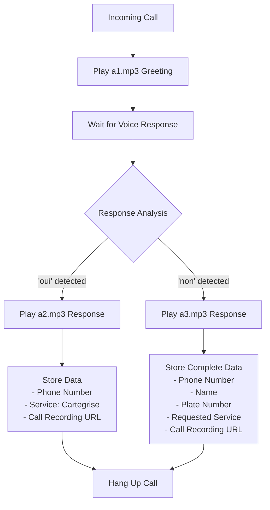

# Client Voice Workflow Implementation

## Overview
This document describes the workflow for implementing a client voice-based call system where:
1. Play client's recorded greeting (a1.mp3)
2. Based on user response ('oui' or 'non'), play corresponding response (a2.mp3 or a3.mp3)
3. Store client data in Google Sheets with call recording URL

## Workflow Diagram

## Detailed Implementation Steps

### 1. Voice File Management
- Voice files are located in `C:\Users\pc\Desktop\botcalls\voice\`
- Files: a1.mp3 (greeting), a2.mp3 (positive response), a3.mp3 (negative response)
- These files need to be accessible via URL for Twilio to play them

### 2. Speech Recognition Enhancement
- Need to improve speech recognition to specifically detect "oui" and "non" responses
- Current system uses general parsing which extracts name, plate, and service
- Will add specific logic to detect simple "oui"/"non" responses

### 3. Response Handling Logic
- When "oui" is detected:
  * Play a2.mp3
  * Store only phone number, service="Cartegrise", and recording URL
- When "non" is detected:
  * Play a3.mp3
  * Store complete data (phone number, name, plate, service, recording URL)

### 4. Data Storage
- Continue using Google Sheets for data storage
- Maintain existing storage structure with additional service type handling

### 5. Call Flow Implementation
1. Incoming call triggers playing of a1.mp3
2. System waits for speech input
3. Speech is analyzed for "oui" or "non"
4. Appropriate response file is played (a2.mp3 or a3.mp3)
5. Data is stored based on response type
6. Call is terminated

## Technical Implementation Plan

### Step 1: Update Speech Parsing
- Modify [parse-speech.js](file:///c%3A/Users/pc/Desktop/botcalls/parse-speech.js) to detect simple "oui"/"non" responses
- Add new function to check for binary responses

### Step 2: Create New Call Flow Endpoint
- Add new endpoint in [server.js](file:///c%3A/Users/pc/Desktop/botcalls/server.js) for the client voice workflow
- Implement the specific logic for a1/a2/a3.mp3 handling

### Step 3: Update Data Storage Logic
- Modify data storage to handle the two different data collection scenarios
- Ensure proper service tagging as "Cartegrise" for "oui" responses

### Step 4: Serve Voice Files
- Ensure voice files are accessible via HTTP for Twilio playback
- May need to serve static files from the voice directory

## Files to be Modified

1. [parse-speech.js](file:///c%3A/Users/pc/Desktop/botcalls/parse-speech.js) - Add binary response detection
2. [server.js](file:///c%3A/Users/pc/Desktop/botcalls/server.js) - Implement new call flow
3. Possibly [client-voice-manager.js](file:///c%3A/Users/pc/Desktop/botcalls/client-voice-manager.js) - If additional voice management is needed

## Expected Data Storage Format

For "oui" responses:
| Timestamp | Phone Number | Name | Plate | Service | Recording URL |
|-----------|--------------|------|-------|---------|---------------|
| ... | +33XXXXXXXXX | Unknown | Unknown | Cartegrise | [URL] |

For "non" responses:
| Timestamp | Phone Number | Name | Plate | Service | Recording URL |
|-----------|--------------|------|-------|---------|---------------|
| ... | +33XXXXXXXXX | [Parsed Name] | [Parsed Plate] | [Parsed Service] | [URL] |